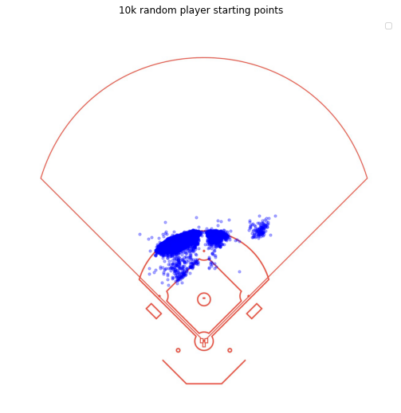

# Toronto Blue Jays 2021-01 Questionnaire - Baseball Research Analyst<!-- omit in toc -->

Written by Dan Goldberg, 2021-01-19

- [Question 1: Which shortstop converted the most outs above average?](#question-1-which-shortstop-converted-the-most-outs-above-average)
  - [1 - Methodology](#1---methodology)
    - [1.1 - Feature Design](#11---feature-design)
    - [1.2 - Candidate Models](#12---candidate-models)
    - [1.3 - Training Method](#13---training-method)
    - [1.4 - Model Evaluation & Selection](#14---model-evaluation--selection)
  - [2 - Code](#2---code)
    - [2.1 - ModelExperiment (utils.ml_training)](#21---modelexperiment-utilsml_training)
    - [2.2 - ModelPersistance (utils.ml_utils)](#22---modelpersistance-utilsml_utils)
    - [2.3 - Diamond (utils.viz_utils)](#23---diamond-utilsviz_utils)
- [Question 2: In addition to what’s included in the provided dataset, what variables or types of information do you think would be helpful in answering this question more effectively?](#question-2-in-addition-to-whats-included-in-the-provided-dataset-what-variables-or-types-of-information-do-you-think-would-be-helpful-in-answering-this-question-more-effectively)
- [Question 3: Other than the final leaderboard, what is one interesting or surprising finding you made?](#question-3-other-than-the-final-leaderboard-what-is-one-interesting-or-surprising-finding-you-made)
- [Appendix](#appendix)
  - [1 - Inferred Interception Point](#1---inferred-interception-point)

## Question 1: Which shortstop converted the most outs above average?

The leader in OAA in this dataset was \[playername\] with \[outs\] converted above average.

### 1 - Methodology

Want to know the likelihood of the average shortstop making an out on a given play (i.e. 70%), and observe if the shortstop being evaluated made the play, turning that probabity into 100%, adding the differnce for that particular observation (100% - 70% = 30%). Multivariate input, probability as output, and learning some function from the input to the output that minimizes the log-loss objective. 

Programmed in python leveraging scikit-learn, tensorflow.keras, and Stan (pyStan). 

#### 1.1 - Feature Design

Goal was to design features that would be describe the difficulty of the play regardless of where the shortstop was positioned on the field (show picture of starting position).

#### 1.2 - Candidate Models

- Individual Model With Probability Output (i.e. Logistic Regression, Neural Network w/Sigmoid Activation, GAM w/Logit Link)
- Ensemble of non-probabilistic classification models for bootstrapped probability score (i.e. Gradient Boosted or Random Forest Decision Trees)

(Discuss linear vs non-linear )

#### 1.3 - Training Method

For non Bayesian Models (no priors):

- k-fold Cross Validation for evaluating the log-loss objective (inner loop)
- Bayesian Optimization for Hyperparameter Tuning (outer loop)

For Bayesian Models (w/ priors on parameters):

- Using Stan to define model and NUTS optimizer. 
- Carefully select priors by simulating in output space.

#### 1.4 - Model Evaluation & Selection

- Want out-of-sample Log-Loss, regardless of whether the model was Bayesian or non-Bayesian

### 2 - Code

My programming efforts focused on creating functionality to make useful visualizations of the data, a generic pipeline for training models, and a way to save models for evaluation and model selection. I also wanted to showcase my skills in building modelling code for production

#### 2.1 - ModelExperiment (utils.ml_training)

Implements the training scheme for non-Bayesian models, including the inner loop k-fold cross validation, outer loop bayesian optimization, and model saving. 

#### 2.2 - ModelPersistance (utils.ml_utils)

Saves models trained in baysian optimization experiment so it's easy to load the exact model, along with meta-data of the model like parameter settings and the value of objective funciton at those settings. This makes it easy to check on the results of an experiment and load the best model to re-train and deploy. 

#### 2.3 - Diamond (utils.viz_utils)

Built as part of exporing the dataset, this class provides a convenient way to plot coordinates on a to-scale diagram of a generic baseball diamond, along with line segments for ball trajectory and player trajectory. 

## Question 2: In addition to what’s included in the provided dataset, what variables or types of information do you think would be helpful in answering this question more effectively? 

- Number of outs at the time of play - impossible to model doubleplays without this (need to know if doubleplay is even possible, or if there's two outs).
- Actual position of interception - would help break up components of range, field, and throw. Would also be an important step for modelling probability of doubleplay.
- The handedness of the batter and the speed of the batter - to estimate the batters time to first base.
- The speed of the baserunners - to estimate the time to their destination base.
- The handedness of the pitcher, maybe.
- Accurate spin readings, plus 3D spin, not just 2D spin. 
- The ballpark - they might have different hop profiles for groundballs due to different materials (i.e. turf), groundskeeping, design of infield.

## Question 3: Other than the final leaderboard, what is one interesting or surprising finding you made? 

While exploring the shortstop defense dataset I became interested in the launch spin and launch axis measurements. These columns contain much missing data, and I thought that they might be useful for modelling the probability of the shortstop making an out - my hypothesis was that a groundball with top spin or side spin might behave much more eradically than a ball starting with backspin, and that more spin might make some plays like charging plays more difficult. I thought that I would try to impute the missing values in some way to try to utilize the useful information that the non-missing values might have for modelling out probability. To do this I created a model of spin using a few features I thought would be causally related to spin - launch speed and launch angle. 

## Appendix

### 1 - Inferred Interception Point

Many important starting-point-agnostic features I built relied on having a particular point where the player might intercept the ball. To approximate where the player might intercept the ball (if possible) I used the following variables:

&nbsp;&nbsp;&nbsp;&nbsp;&nbsp;&nbsp;$s_{player} \rightarrow \textrm{speed of player (ft/s)}$  
&nbsp;&nbsp;&nbsp;&nbsp;&nbsp;&nbsp;$s_{ball} \rightarrow \textrm{speed of ball (ft/s)}$  
&nbsp;&nbsp;&nbsp;&nbsp;&nbsp;&nbsp;$\bold{p} \rightarrow \textrm{starting position of player}$  
&nbsp;&nbsp;&nbsp;&nbsp;&nbsp;&nbsp;$\bold{b} \rightarrow \textrm{position of ball at interception (also the position of the player at interception)}$  
&nbsp;&nbsp;&nbsp;&nbsp;&nbsp;&nbsp;$time_{player} \rightarrow \textrm{time for player to move from starting position to interception position}$  
&nbsp;&nbsp;&nbsp;&nbsp;&nbsp;&nbsp;$time_{player} \rightarrow \textrm{time for ball to move from launch position to interception position}$  

We are trying to solve the equation
$$time_{player}=time_{ball}$$ 
for unknown $\bold{b} $ if a real root exists. If no real root exists then the player cannot intercept the ball. For this derivation we will make the simplification that the player speed, $s_{player}$, and ball speed, $s_{ball}$, are constant. We know this is incorrect because the player will accellerate or decelerate over time, and the ball will decelerate due to air or ground friction. We also assume the ball doesn't move in a 3rd dimension (up and down) and that the speed is parallel to the ground. 

$$time_{player}= \frac{\parallel \bold{b} - \bold{p} \parallel}{s_{player}}$$  
$$time_{ball}= \frac{\parallel \bold{b} \parallel}{s_{ball}}$$

We will decompose the $\bold{b}$ vector into its component $x, y$ dimensions since we can leverage knowledge about the relationship between these components assuming a straight-line ball trajectory.

For the ball vector, $\bold{b}$, we know that the span of this vector falls on $y=mx$ since it starts at the origin.

$$\parallel \bold{b} \parallel = \sqrt{b_{x}^{2} + m^{2}b_{x}^{2}} = \sqrt{(m^{2}+1)b_{x}^{2}}$$
Where
$$m = \frac{b_{y}}{b_{x}}$$

And, decomposing $\bold{p}$ in the same way:

$$\parallel \bold{b} - \bold{p} \parallel = \sqrt{(b_{x} - p_{x})^{2} + (mb_{x}-p_{y})^{2}}$$
$$ = \sqrt{b_{x}^{2} - 2b_{x}p_{x} + p_{x}^2 + m^2b_{x}^{2} - 2mb_{2}p_{y} + p_{y}^2}$$
$$ = \sqrt{b_{x}^{2} + m^2b_{x}^{2} - 2b_{x}p_{x} - 2mb_{x}p_{y} + p_{x}^2 + p_{y}^2}$$
$$ = \sqrt{(m^2 + 1)b_{x}^{2} - 2(p_{x} + mp_{y})b_{x} + p_{x}^2 + p_{y}^2}$$

Now, substituting these into the full equation:

$$\frac{\sqrt{(m^{2}+1)b_{x}^{2}}}{s_{ball}} = \frac{\sqrt{(m^2 + 1)b_{x}^{2} - 2(p_{x} + mp_{y})b_{x} + p_{x}^2 + p_{y}^2}}{s_{player}} $$

Squaring both sides and rearranging, we get:

$$ (\frac{s_{player}}{s_{ball}})^2(m^{2} + 1)x^{2} =  (m^2 + 1)b_{x}^{2} - 2(p_{x} + mp_{y})b_{x} + p_{x}^2 + p_{y}^2$$

Giving the quadratic equation of the form $0 = ax^2 + bx + c$:

$$ 0 = (1 - (\frac{s_{player}}{s_{ball}})^2)(m^{2} + 1)x^{2} - 2(p_{x} + mp_{y})b_{x} + p_{x}^2 + p_{y}^2$$

where

$$ a = (1 - (\frac{s_{player}}{s_{ball}})^2)(m^{2} + 1)$$
$$ b = - 2(p_{x} + mp_{y})$$
$$ c = p_{x}^2 + p_{y}^2$$

which can be solved using the quadratic formula (np.roots in numpy). 

