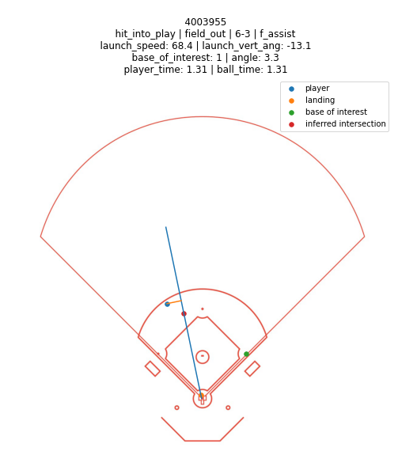

# Toronto Blue Jays 2021-01 Questionnaire Responses (Baseball Research Analyst)<!-- omit in toc -->

By Dan Goldberg, 2021-01-19
[Project Github Repository](https://github.com/dan-goldberg/interviews/tree/master/tbj/tbj_202101)

- [Question 1: Which shortstop converted the most outs above average?](#question-1-which-shortstop-converted-the-most-outs-above-average)
  - [1 - Methodology](#1---methodology)
    - [1.1 - The Dataset](#11---the-dataset)
    - [1.2 - Candidate Models](#12---candidate-models)
    - [1.3 - Training Method](#13---training-method)
    - [1.4 - Model Evaluation & Selection](#14---model-evaluation--selection)
  - [2 - Code](#2---code)
    - [2.1 - utils.preprocessing i.e. shortstop_global_preprocessing()](#21---utilspreprocessing-ie-shortstop_global_preprocessing)
    - [2.2 - utils.geometry i.e. likely_interception_point()](#22---utilsgeometry-ie-likely_interception_point)
    - [2.3 - utils.ml_training i.e. ModelExperiment](#23---utilsml_training-ie-modelexperiment)
    - [2.4 - utils.ml_utils i.e. ModelPersistance](#24---utilsml_utils-ie-modelpersistance)
    - [2.5 - utils.viz_utils i.e. Diamond](#25---utilsviz_utils-ie-diamond)
- [Question 2: In addition to what’s included in the provided dataset, what variables or types of information do you think would be helpful in answering this question more effectively?](#question-2-in-addition-to-whats-included-in-the-provided-dataset-what-variables-or-types-of-information-do-you-think-would-be-helpful-in-answering-this-question-more-effectively)
- [Question 3: Other than the final leaderboard, what is one interesting or surprising finding you made?](#question-3-other-than-the-final-leaderboard-what-is-one-interesting-or-surprising-finding-you-made)
- [Appendix](#appendix)
  - [1 - Inferred Interception Point](#1---inferred-interception-point)
  - [2 - Model Comparison Jupyter Notebook](#2---model-comparison-jupyter-notebook)

## Question 1: Which shortstop converted the most outs above average?

The leader in Outs Above Average (OAA) in this dataset was playerid 162066 with 11.09 outs above average. I used a fully Bayesian model (Multilevel Logistic Regression) so the leaderboard below has OAA_mean (the point estimate of OAA) and OAA_std (the uncertainty around that estimate) instead of just OAA. I've also added OAA_per_Opp to give a rate stat next to the counting OAA stat.

|   rank |   playerid |   opportunities |   OAA_mean |   OAA_std |   OAA_per_Opp |
|-------:|-----------:|----------------:|-----------:|----------:|--------------:|
|      1 |     162066 |           227.9 |      11.09 |      4.83 |         0.049 |
|      2 |     162648 |           196.6 |       9.15 |      4.04 |         0.047 |
|      3 |     197513 |            90.3 |       4.46 |      1.91 |         0.049 |
|      4 |     154448 |           225.9 |       4.34 |      3.78 |         0.019 |
|      5 |       9742 |            97.6 |       4.22 |      1.8  |         0.043 |
|      6 |       2950 |           151.2 |       4.11 |      2.73 |         0.027 |
|      7 |     168314 |           178.1 |       4.07 |      3.1  |         0.023 |
|      8 |       5495 |           226.8 |       3.98 |      3.78 |         0.018 |
|      9 |       9148 |           155.7 |       2.88 |      2.65 |         0.018 |
|     10 |       9074 |           181   |       2.81 |      3.19 |         0.016 |
|     11 |     162294 |            50   |       2.67 |      1.13 |         0.053 |
|     12 |     132551 |           200.5 |       2.65 |      3.5  |         0.013 |
|     13 |     161551 |           231.2 |       2.36 |      3.51 |         0.01  |
|     14 |     171164 |            13   |       2.02 |      0.24 |         0.155 |
|     15 |       5419 |           163.9 |       2.02 |      2.74 |         0.012 |
|     16 |       7580 |           121.8 |       1.64 |      1.97 |         0.013 |
|     17 |     167746 |            26.6 |       1.48 |      0.56 |         0.056 |
|     18 |      11742 |           214.5 |       1.22 |      3.15 |         0.006 |
|     19 |     184486 |             9   |       1.17 |      0.25 |         0.129 |
|     20 |     121615 |            31.8 |       1.13 |      0.6  |         0.036 |

/* note that this metric excludes outs above average added due to increasing the likelihood of a doubleplay or from tagging basestealers. I decided not to try to handle those special, and much tougher, cases; the available data is insufficient to quanitfy those aspects of making outs. Instead, this model only looks at whether the SS got the out making the primary play, being the first to touch the ball.

### 1 - Methodology

To estimate the OAA metric I decided to follow the lead of [Tom Tango and the Statcast team](https://www.mlb.com/news/statcast-introduces-outs-above-average-for-infield-defense) and train a probabilistic model to predict the likelihood of an average shortstop making an out on a given play. As they explain, using this probability (i.e. 70%) we can then take the observed outcome as a binary variable (0 or 1) and interpret the shortstop of converting that original probability into either 0% (failure) or 100% (success). For example if the shortstop makes the play they would be adding the difference for that particular observation (100% - 70% = 30%) and get that amount of credit (i.e. 0.3 outs above average). 

So the plan was to train a probabilistic model to learn some function from a multivariate input (some features of a given play) to a probability of an average shortstop making an out. To do this I wanted to experiment with different kinds of model families, and different hyperparameter configurations within model families. The space of potential models would be those which could output some probability with respect to a binary outcome, and so each potential model could be optimized against a log-loss objective. 

It being my strongest programming language and having a rich statistical ecosystem second only to R, I programmed in python, mostly leveraging scikit-learn. 

#### 1.1 - The Dataset

In exploring and preprocessing the dataset I had two goals in mind. 

The first goal was to find an appropriate subset of all groundballs that the shortstop should be evaluated on. For example, when the shortstop is on the 3B side of the infield, a groundball to 1B really has nothing to do with the SS (in most cases) and so the SS should not get any credit or blame for an out being or not being made. The SS should only be evaluated on plays the could have potentially had some impact on. I decided as a starting point to filter out any plays that were made by another infielder (i.e. the 3B cuts in front of the SS and then makes the out at first) or any plays that were not turned into outs. This would still include some plays that were completely out of the SS's reach, though I address this in the design of input features for the model.

The second goal was to turn the raw dataset into input features that would describe the difficulty of the groundball (from the SS perspective) in such a way that was agnostic to where the SS was initially positioned. Doing so would require capturing the relative positions of the batted ball and the shortstop no matter where the SS stood. As it turns out, the starting position for a SS varies quite a bit, as seen in this plot of the SS starting position on 10k random groundballs.

I decided that there is a lot of information about the difficulty of the play in the batted ball trajectory. From both [Fangraphs](https://library.fangraphs.com/defensive-runs-saved-2020-update/) and [Statcast](https://www.mlb.com/news/statcast-introduces-outs-above-average-for-infield-defense), OAA decomposes a defensive play into the following components of a play: positioning, range, fielding, and throwing, with positioning being a component that the team gets credit for rather than the player. By utilizing the batted ball trajectory I thought I could create some features that captured aspects of range, fielding, and throwing, though certainly imperfectly. The following were some intermediate features I designed using this data:
- The orthogonal projection from the player position vector to the span of the launch trajectory. This gives the absolutely smallest distance the player would have to move to get in the ball's path (albeit possibly after the ball has passed that point).
- The inferred interception point, if it exists - the point that minimizes the player's time to the ball's path. This assumes the player moves at 21 ft/s, which is less than the ~25ft/s many players can sprint at, according to Statcast (though still a gross simplification). I used calculations outlined in the [Appendix](#appendix) to solve this minimization equation. 
- The assumed "base of interest" for the player, depending on the runners on base and whether they are in motion or not. This is a prerequisite for the next feature.
- The angle to the base of interest at either the inferred interception point, or the orthogonal projection point if that doesn't exist. This is intended to capture an aspect of the player's momentum towards or away from the base the will throw to.
- The time it takes to get to the intersection point (or orthogonal projection point), where the hypothesis is that less time is better, and gives the defender more time to complete the play. 
- The difference between the ball's time to the interception point and the SS's time to the interception point. If the ball takes much less time to reach that interception point then it is very unlikely the SS can actually field the ball - this should be quite a reliable indication of whether the play is well outside the fielder's range or not.

I created a visualization tool while exploring the dataset and developing these features which makes these descriptions a bit clearer. The following are some examples of groundball observations from the dataset, which are considered evaluation datapoints for the SS:

In this example you can see the player's starting position as the blue dot, and the span of the ball's launch trajectory as the blue line. The orange dot is where the ball landed, and the red dot is where the player could intercept the ball to minimize time to the ball - in this case since the player is already on the ball's trajectory it would just mean charging the ball. The green dot is indicating that 2B is the base of interest in this case, meaning there's a runner on 1B and a force play at 2B (plus the runner is not in motion).

In the second example you can see a similar situation, except now the ball's trajectory is to the player's left. There is still a red dot indicating there is an inferred interception point. However in this example it is easier to see the orange line, which is the shortest path to the ball's trajectory span, orthogonal to the trajectory. The "angle to the base of interest" feature captures the angle between the green, blue, and red dots, with the blue (player position) as the vertex. In this case the angle is very acute (close to 0) and the player's momentum will be carrying him towards the base as he intercepts the ball at the red dot. 

This example illustrates a tough play in the hole, where the angle is > 90 degrees to 1B. 

Here are more examples, some of which have no red dot, meaning given the player speed assumption the player cannot intercept the ball at all. There are times when a player does intercept the ball despite this calculation not giving an inferred interception point, though this means the SS has likely made a very tough, high-range play. 

All features were standard-scaled before being fed into each model, since some models (like Support Vector Machines) assumed scaled features. I started out also applying a log transform before scaling two of the features, but never progressed to experimenting with different feature scalings. With more time I would've run experiments on scaling and also on withholding certain features; one of my worries about the design matrix I used was high correlation between inputs, which might cause more difficult training for some of the models. Given the time constrains, though, I moved on with what I thought was a solid design matrix. 

#### 1.2 - Candidate Models

The most important prerequisite of this modelling exercise was to train a model to output probabilities. A simple classification or even confidence score would not suffice. For this reason there were three classes of models I initially considered:

1. Generalized linear or non-linear models with inverse logit output (Standard Logistic Regression, Logistic GAM, Logistic Multilevel Regression, Neural Network w/Sigmoid Output)

    These models can be trained on a log-loss (a.k.a. binary cross-entropy) objective which would likely calibrate their probability predictions pretty nicely (though less-so for neural networks). My guess was that these models would do a better job with calibrated probabilities, but I was also concerned that for the linear models they wouldn't be able to learn how to handle any complex non-linear interactions between features that might exist. Still, the closer I can get my features to reflect the true causal graph, the better a linear model might perform. GAMs are very flexible and was my guess for the best option out of this family, though they can be quite manual in the design of the basis functions (I think) and I am not very experienced with GAMs. Multilevel models in particular are attractive because they implement partial pooling to decrease variance and improve the estimates on clusters (levels) with low sample size, and inherently reduce overfitting.

2. Ensemble of non-probabilistic classification models for bootstrapped probability score (i.e. Random Forest Decision Trees, Gradient Boosted Trees)

    Ensemble models have two things going for them - they are fast, and they can make highly accurate class predictions. The downside in this case is that they are not probabilistic, and so they have a good chance of being poorly calibrated in their probability predictions. The only reason they can output what can be used as probability predictions is because they are ensemble models, and so by averaging over multiple component models one can get a sample distribution on an estimate. Ensembles also help reduce overfitting in that many high-variance + low-bias models averaged together create one mid-variance low-bias model. 

3. Other generative models (i.e. Naive Bayes, Mixture of Gaussians, Gaussian Process)

    I thought learning multivariate generative model like a Gaussian Process would been a good candidate since it's so flexible, and would possibly learn a well-calibrated probability, though these models are usually more time-expensive to train. Gaussian processes capture relationships between input vectors in addition to just a function from input to output, so as long as the density across the input space is relatively smooth the GP model should do pretty well, and output decent probability estimates. The rub with Gaussian Processes is in hand designing the kernel (the prior), which is a manual process and adds a lot of complexity when actually trying to make the most out of this model. 

#### 1.3 - Training Method

My approach is to pick a suite of models (those listed above) and for each, to determine a hyperparemeter space to search over, if such hyperparameters require tuning for the model family. My hyperparmeter tuning method of choice is Bayesian Optimization (modelling the loss as a function of hyperparams, usually with a Gaussian Process) since it can be so efficient in it's search through that space and intelligently picks the next configuration to try. For each model family I configured an experiment (model family, hyperparameter space, preprocessing pipeline) to automate a search for the best model as much as possible. I spent quite a lot of time programming utilities to help me execute this Bayesian Optimization plan, which in the end made configuring and running experiments extremely easy. The outer loop over hyperarameters just requires an objective to minimize, and I decided the inner loop would return the mean of the loss across 5-fold cross validation on the model at the given config.

The major exception to this plan was the Multilevel Logistic Regression model, which was a fully Bayesian model and required slightly different tooling, with no hyperparameters. For this model used the python API for Stan to define bespoke model and sample parameters using the NUTS MCMC optimizer. A typical Bayesian workflow would have me carefully select priors by first forward-simulating to output space, though I didn't do this proper workflow due to time constraints; I just did enough work to get the model to converge (which was harder than expected) and used generic priors.

One thing I didn't do but that would've been good to do for this kind of task was to train the non-probabilistic models using probability calibration cross validation. I left this out of scope out of concern for time, privileging the Bayesian Optimization piece over that to leverage automating experiments as much as possible.

#### 1.4 - Model Evaluation & Selection

Each model configuration got a 5-fold cross validation score on the log-loss objective, which is the conditional probability of the output data given the model probabilities. It was my hypothesis that training to this objective aligns the model optimization with probability calibration as much as possible. Once all initial model configurations were trained I could read the results into a dataframe from the model registry (where I saved their details) to find the best model (by log-loss) in each experiment. I then compared each experiment's best model on a number of metrics including Brier score, accuracy, F1, as well as visually inspecting their probability calibration curves and their histogram of probability predictions. Finding the best couple models from this inspection, I then directly compared these two models, picking a winner with an eye on having the best probability estimates possible.

See the python notebook that follows the Appendix in this PDF for the code and graphics from model selection and OAA calculation.

---------------------------------------
### 2 - Code

My programming efforts focused on creating functionality to make useful visualizations of the data, a generic pipeline for training models, and a way to save models for evaluation and model selection. I also wanted to showcase how I would try to build experiment code for production. Please see the github repository for this project [here](https://github.com/dan-goldberg/interviews/tree/master/tbj/tbj_202101).

#### 2.1 - utils.preprocessing i.e. shortstop_global_preprocessing()

This function is where all the feature design and other preprocessing happens. This module has the functionality to load and then convert the raw data into a usable form for any modelling experiments. I decided to abstract away all this processing into a function since my starting point was to have all model experiments share the same features and preprocessing/scaling. This module heavily relies on the utils.geometry module, described below.  

#### 2.2 - utils.geometry i.e. likely_interception_point()

The linear algebra and calculus that I needed to calculate things like the orthogonal projection vector from the player's starting point to the ball's trajectory span, or the likely interception point for the player and ball given some basic assumptions. It was fun figuring out how to put these calculations together - see the [Appendix](#appendix) for the derivation of the likely interception point calculation.

#### 2.3 - utils.ml_training i.e. ModelExperiment

Sets up a (model family, hyperparameter space, preprocessing pipeline) experiment configuration. Implements the training scheme for non-Bayesian models, including the inner loop k-fold cross validation, outer loop bayesian optimization, and model saving in the inner loop. Also allows for single k-fold CV scoring without Bayesian Optimization, or simply training a single model, and then saving the output to the model registry.

#### 2.4 - utils.ml_utils i.e. ModelPersistance

Saves models from an experiment so it's easy to load the exact model from a pickle, along with meta-data of the model like parameter settings and the value of objective function at those settings. This makes it easy to check on the results of an experiment and load the best model to re-train and deploy. Includes a method to load the model from pickle, given the model ID.

#### 2.5 - utils.viz_utils i.e. Diamond

Built as part of exploring the dataset, this class provides a convenient way to plot coordinates on a to-scale diagram of a generic baseball diamond, along with line segments for ball trajectory and player trajectory. I used an svg from this [site](https://www.dimensions.com/element/professional-major-league-baseball-field) and confirmed it is to-scale. 

---------------------------------------
## Question 2: In addition to what’s included in the provided dataset, what variables or types of information do you think would be helpful in answering this question more effectively? 

In gathering more information I'd be interested in doing three things:
1. Be able to model the probability of making a doubleplay.
2. Be able to estimate the probability of caught stealing at 2B on a stolen base attempt. 
3. Improving the current model of SS making the primary play.

In the current dataset there isn't enough information to be able to model doubleplay probabilities. A prerequisite for that is knowing the inning outs before the start of the play - we need to know if doubleplay is even possible, or if there's two outs and hence no doubleplay will happen regardless. With that info we could try to model the doubleplay probabilities given the rest of the current information.

Other than that, there is additional information that would be useful for improving both a model of making a primary play and a model of successful doubleplays:
- Actual position and time of interception - would help break up components of range, field, and throw. 
- Actual position of other fielders - would be an important step for modelling probability of doubleplay if the SS is the one turning the doubleplay.
- The handedness of the batter and the speed of the batter - to estimate the batters time to first base.
- The speed of the baserunners - to estimate the time to their destination base.
- The handedness of the pitcher - probably not super valuable.
- Accurate spin readings, plus 3D spin, not just 2D spin - balls will fly/bounce differently depending on the spin.
- The ballpark - they might have different hop profiles for groundballs due to different materials (i.e. turf), groundskeeping, design of infield.

For modelling OAA from tagging a baserunner we would need to create a model predicting the probability of an out when the SS is receiving a throw at a base and there is a baserunner running to that base. For this we would need to track the specific positions (x,y,z) of the ball as it moves towards the base as well as the positions of the baserunner as he moves towards the base (x,y). Then we could quantify the impact of Javier Baez turning into El Mago.

---------------------------------------
## Question 3: Other than the final leaderboard, what is one interesting or surprising finding you made? 

While exploring the shortstop defense dataset I became interested in the launch spin and launch axis measurements. These columns contain much missing data, and I thought that they might be useful for modelling the probability of the shortstop making an out - my hypothesis was that a groundball with top spin or side spin might behave much more erratically than a ball starting with backspin, and that more spin might make some plays like charging plays more difficult. I didn't end up using the spin values, but at the time I thought that I would try to impute the missing values in some way to try to utilize the useful information that the non-missing values might have for modelling the out probability. To do this I eventually created a model of spin using a few features I thought would be causally related to spin - launch speed and launch angle (horizontal and vertical). 

First when I was exploring the dataset I noticed is that there is a weird concentration of launch_spin_rate between approximately 7000 and 8000 rpm. This concentration of density is actual discontinuous with the general, seemingly gaussian density around 3000 rpm. Here is a histogram of launch_spin_rate:

This > 7000 rmp density is so separated from the central density, that this is evidence of some separate causal process leading to these high spin measurements. Looking at spin rate compared to launch speed, we still see a clear second density.

Faulty measurement equipment is one potential theory, though I also thought that it could be caused by something on the field: if a pitcher were using a foreign substance like pine tar it might increase the likelihood of very high spin batted balls. Of course, that possibility could exist no matter what the pitcher does since a batter might contact the ball on a spot of the bat that has pine tar on it (hello George Brett!). These high-spin observations still could be caused by some combination of launch angle and speed, so I decided that I would try to create a model of launch_spin_rate as a function of other launch parameters (angle, speed, hang time, and distance). If the model was unable to predict this second mode at all, then it would be more evidence of a different mechanism at play causing these high spin measurements.

I trained an XGBoost Regressor to predict spin rate from the launch characteristics mentioned above, and this was the result:

And clearly, though the model did pretty well it still leaves a distinct mode between 7000 and 8000 rpm which isn't predicted with anywhere near the same accuracy as the rest of the range. This approach made me think that if a team were interested in figuring out which pitchers use high-grip foreign substance they could create a statistical model of spin rate and find the pitchers with the highest incidence of outliers, as in this case. 

Having said this, my money would still be on equipment measurement error in this case, and I would investigate that hypothesis by looking for in-game correlations between spin rates, controlling for other factors. I didn't go down that route due to time constraints, though I decided that I would ignore the spin values in modelling shortstop OAA.

As an aside, I also thought about using Alan Nathan's [Trajectory Calculator](http://baseball.physics.illinois.edu/trajectory-calculator-new.html) to model/impute the spin measurements, which might also be a good way to try to identify outliers. 

---------------------------------------
## Appendix

### 1 - Inferred Interception Point

Many important starting-point-agnostic features I built relied on having a particular point where the player might intercept the ball. To approximate where the player might intercept the ball (if possible) I used the following variables:

&nbsp;&nbsp;&nbsp;&nbsp;&nbsp;&nbsp;$s_{player} \rightarrow \textrm{speed of player (ft/s)}$  
&nbsp;&nbsp;&nbsp;&nbsp;&nbsp;&nbsp;$s_{ball} \rightarrow \textrm{speed of ball (ft/s)}$  
&nbsp;&nbsp;&nbsp;&nbsp;&nbsp;&nbsp;$\bold{p} \rightarrow \textrm{starting position of player}$  
&nbsp;&nbsp;&nbsp;&nbsp;&nbsp;&nbsp;$\bold{b} \rightarrow \textrm{position of ball at interception (also the position of the player at interception)}$  
&nbsp;&nbsp;&nbsp;&nbsp;&nbsp;&nbsp;$time_{player} \rightarrow \textrm{time for player to move from starting position to interception position}$  
&nbsp;&nbsp;&nbsp;&nbsp;&nbsp;&nbsp;$time_{player} \rightarrow \textrm{time for ball to move from launch position to interception position}$  

We are trying to solve the equation
$$time_{player}=time_{ball}$$ 
for unknown $\bold{b} $ if a real root exists. If no real root exists then the player cannot intercept the ball. For this derivation we will make the simplification that the player speed, $s_{player}$, and ball speed, $s_{ball}$, are constant. We know this is incorrect because the player will accelerate or decelerate over time, and the ball will decelerate due to air or ground friction. We also assume the ball doesn't move in a 3rd dimension (up and down) and that the speed is parallel to the ground. 

$$time_{player}= \frac{\parallel \bold{b} - \bold{p} \parallel}{s_{player}}$$  
$$time_{ball}= \frac{\parallel \bold{b} \parallel}{s_{ball}}$$

We will decompose the $\bold{b}$ vector into its component $x, y$ dimensions since we can leverage knowledge about the relationship between these components assuming a straight-line ball trajectory.

For the ball vector, $\bold{b}$, we know that the span of this vector falls on $y=mx$ since it starts at the origin.

$$\parallel \bold{b} \parallel = \sqrt{b_{x}^{2} + m^{2}b_{x}^{2}} = \sqrt{(m^{2}+1)b_{x}^{2}}$$
Where
$$m = \frac{b_{y}}{b_{x}}$$

And, decomposing $\bold{p}$ in the same way:

$$\parallel \bold{b} - \bold{p} \parallel = \sqrt{(b_{x} - p_{x})^{2} + (mb_{x}-p_{y})^{2}}$$
$$ = \sqrt{b_{x}^{2} - 2b_{x}p_{x} + p_{x}^2 + m^2b_{x}^{2} - 2mb_{2}p_{y} + p_{y}^2}$$
$$ = \sqrt{b_{x}^{2} + m^2b_{x}^{2} - 2b_{x}p_{x} - 2mb_{x}p_{y} + p_{x}^2 + p_{y}^2}$$
$$ = \sqrt{(m^2 + 1)b_{x}^{2} - 2(p_{x} + mp_{y})b_{x} + p_{x}^2 + p_{y}^2}$$

Now, substituting these into the full equation:

$$\frac{\sqrt{(m^{2}+1)b_{x}^{2}}}{s_{ball}} = \frac{\sqrt{(m^2 + 1)b_{x}^{2} - 2(p_{x} + mp_{y})b_{x} + p_{x}^2 + p_{y}^2}}{s_{player}} $$

Squaring both sides and rearranging, we get:

$$ (\frac{s_{player}}{s_{ball}})^2(m^{2} + 1)x^{2} =  (m^2 + 1)b_{x}^{2} - 2(p_{x} + mp_{y})b_{x} + p_{x}^2 + p_{y}^2$$

Giving the quadratic equation of the form $0 = ax^2 + bx + c$:

$$ 0 = (1 - (\frac{s_{player}}{s_{ball}})^2)(m^{2} + 1)x^{2} - 2(p_{x} + mp_{y})b_{x} + p_{x}^2 + p_{y}^2$$

where

$$ a = (1 - (\frac{s_{player}}{s_{ball}})^2)(m^{2} + 1)$$
$$ b = - 2(p_{x} + mp_{y})$$
$$ c = p_{x}^2 + p_{y}^2$$

which can be solved using the quadratic formula (np.roots in numpy). 

### 2 - Model Comparison Jupyter Notebook

Please see below.